# Erros Comuns relatados

Essa sessão está destinada a relatar os erros comuns que podem ocorrer ao tentar realizar uma simulação no modelsim.

## Erro: the -novopt option is now deprecated and will be removed in a future release.

> **Observação:** A solução é a mesma para Windows e Linux.

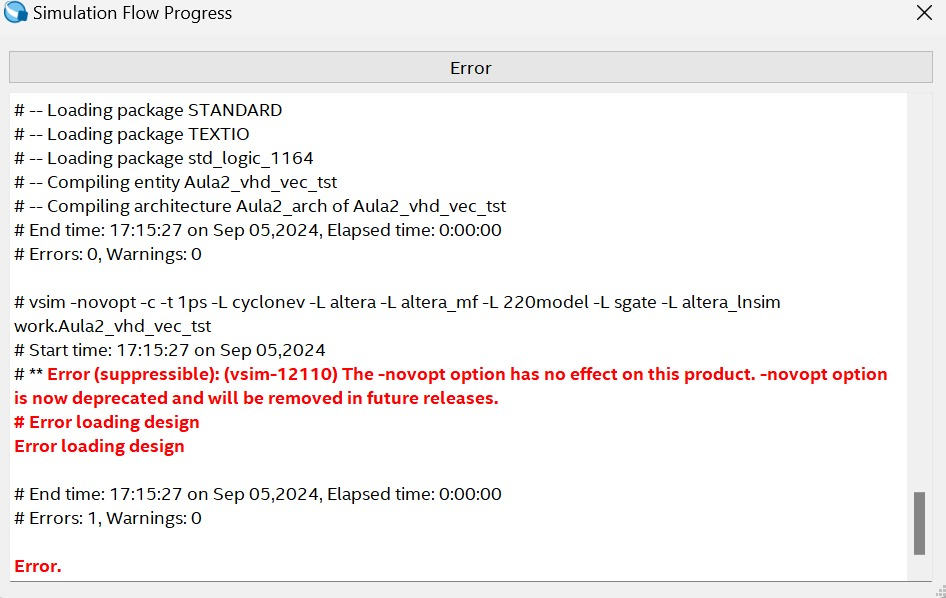

Esse é um dos erros mais comuns e sua solução é muito simples. Basta remover a flag `-novopt` do arquivo de compilação do modelsim. 

Para isso, feche a janela com o erro. Em seguida, na janela do Modelsim, na parte superior, acesso Simulation -> Simulation Settings

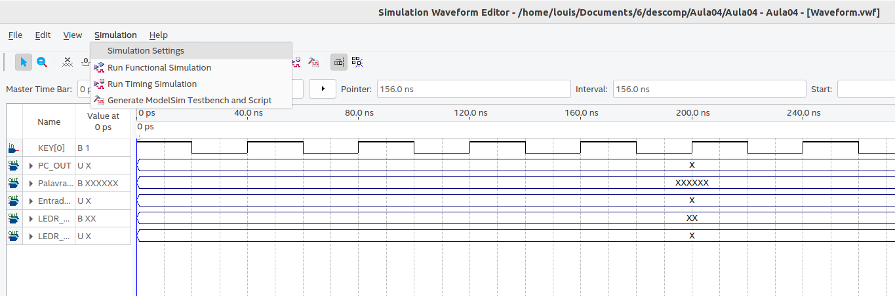

A seguinte aba irá aparecer

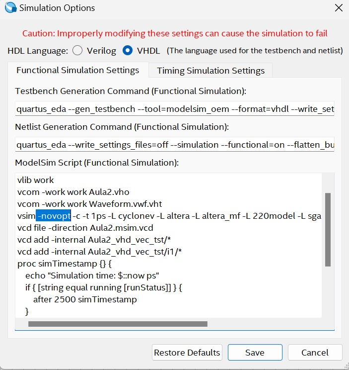

Localize a flag `-novopt`, igual a que está na imagem acima, e a remova (apague apenas a flag `-novopt` e não o resto do comando). Após isso, clique em Save e rode a simulação novamente.

## Erro: ModelSim executable not found in ...

> **Observação:** A solução é muito parecida para Windows e Linux.

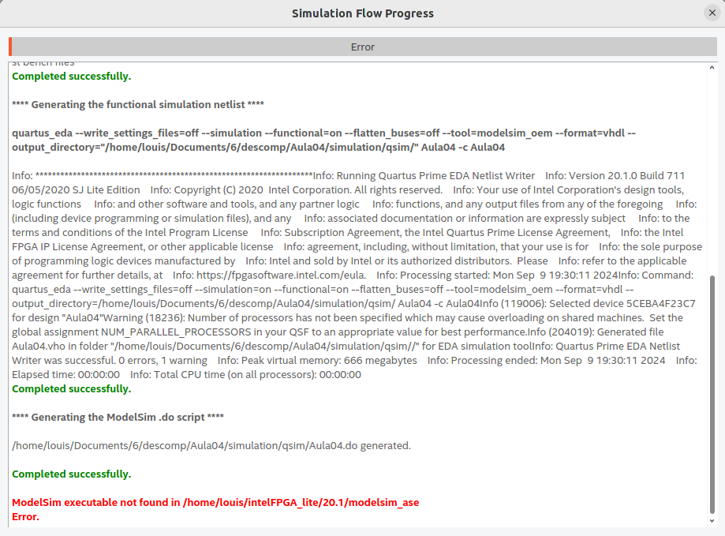

Nesse caso, o erro ocorre porque o Modelsim não está conseguindo localizar o executável do Modelsim. Para resolver esse problema, é necessário adicionar o caminho do executável do Modelsim no EDA Tools Path.

Para isso, feche a janela com o erro, salve seu arquivo de simulação e, por fim, feche o ModelSim.

Em seguida, no Quartus, acesse Tools -> Options

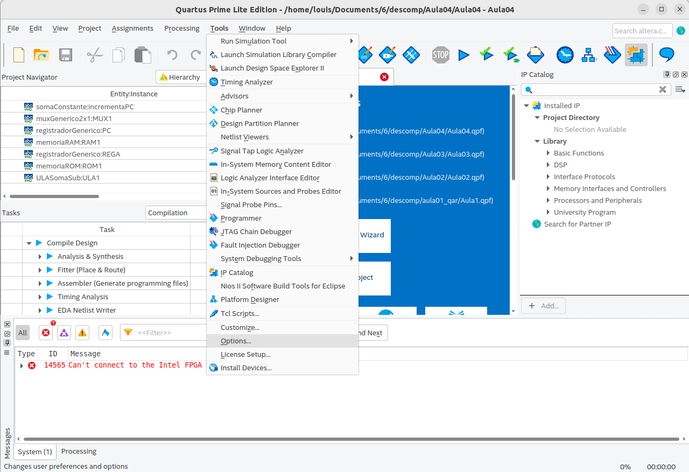

A seguinte janela irá aparecer:

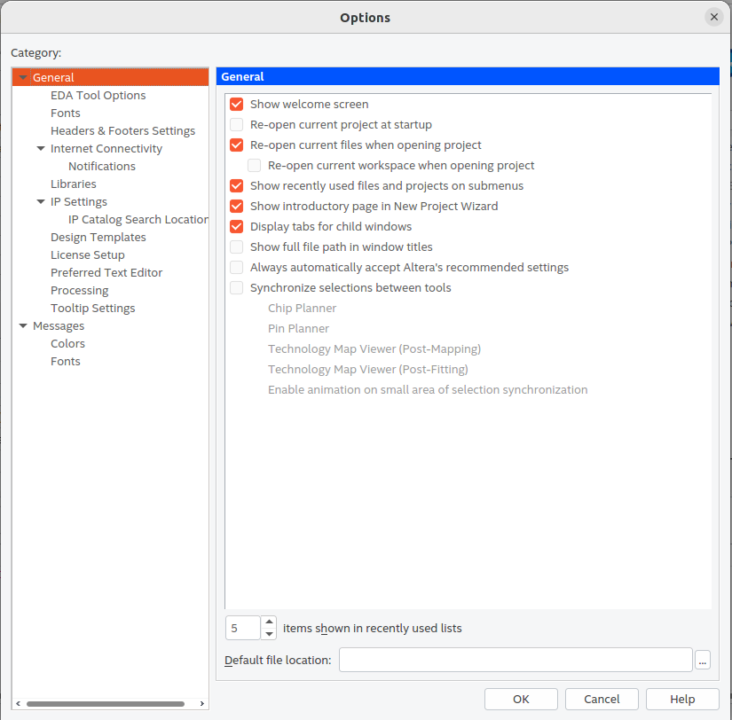

Selecione a aba EDA Tool Options

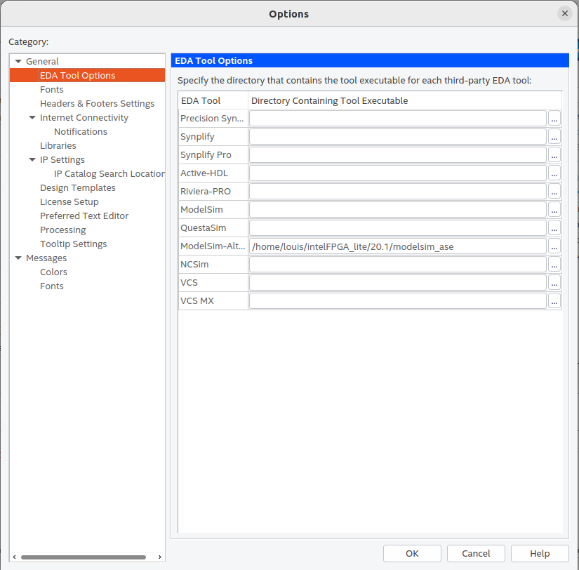

Altere o caminho registrado no campo ModelSim-Altera, a pasta final deve terminar em `aloem`. No caso de Linux, o caminho padrão é `/home/${USER}/IntelFPGA_lite/20.1/modelsim_ase/linuxaloem/`, enquanto no Windows é `C:/intelFPGA_lite/20.1/modelsim_ase/win32aloem/`. Após alterar o caminho, clique em OK e rode a simulação novamente.

Após realizar essa correção, abre o modelSim novamente e tente rodar a simulação.

## Erro: Invalid license environment. Application closing.

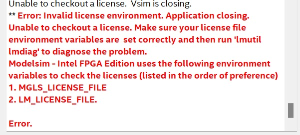

Esse erro ocorre por conta de um engano na instalação do ModelSim. Para resolver esse problema, é necessário desinstalar o ModelSim e instalar novamente.

Por isso, salve a sua simulação e feche o modelsim e o Quartus.

> **No Windows** 

Para desinstalar o ModelSim, acesse o Painel de Controle -> Programas -> Desinstalar um programa. Localize o ModelSim e clique em Desinstalar.

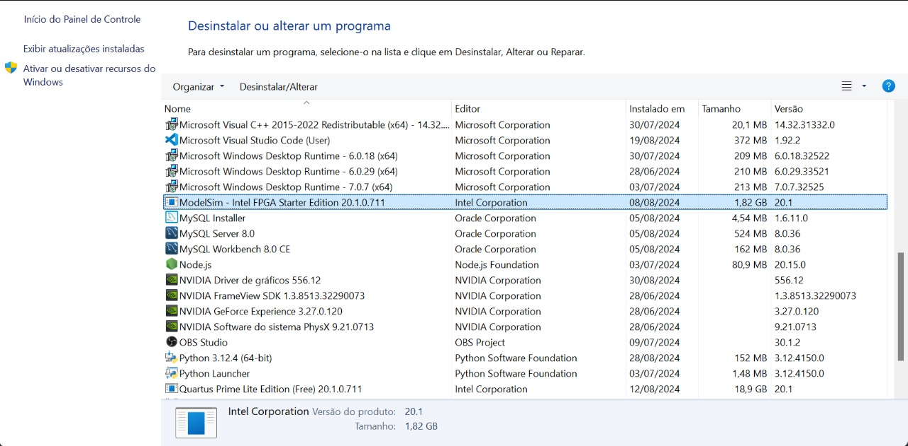

> **No Linux**

Delete a pasta do modelsim. Caso não saiba onde está localizada, acesse o terminal e digite `which vsim`. O terminal irá retornar o caminho do executável do ModelSim. Após isso, delete a pasta do ModelSim.

Após desinstalar o ModelSim, instale novamente. Para isso, siga o tutorial de instalação do ModelSim.

1. Acesse https://www.intel.com/content/www/us/en/software-kit/750637/modelsim-intel-fpgas-standard-edition-software-version-20-1.html

Garanta que está baixando a versão 20.1 do modelsim. E escolha a versão conforme seu sistema operacional.

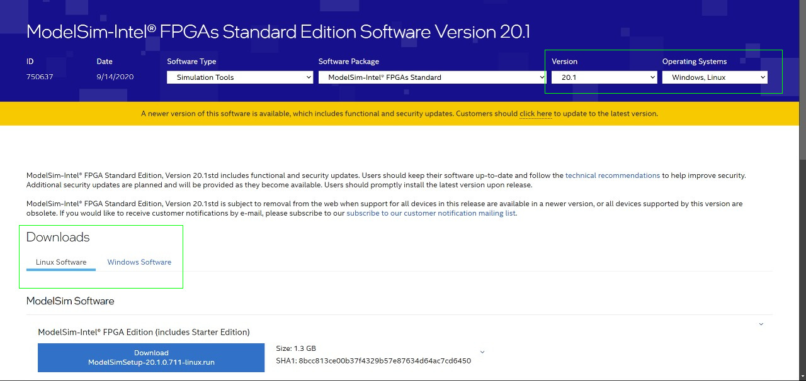

2. Rode o programa que foi baixado

Logo no início, o programa irá pedir para você aceitar os termos de uso. Após aceitar, escolha o modelSim - IntelFPGA STARTER EDITION e clique em Next.

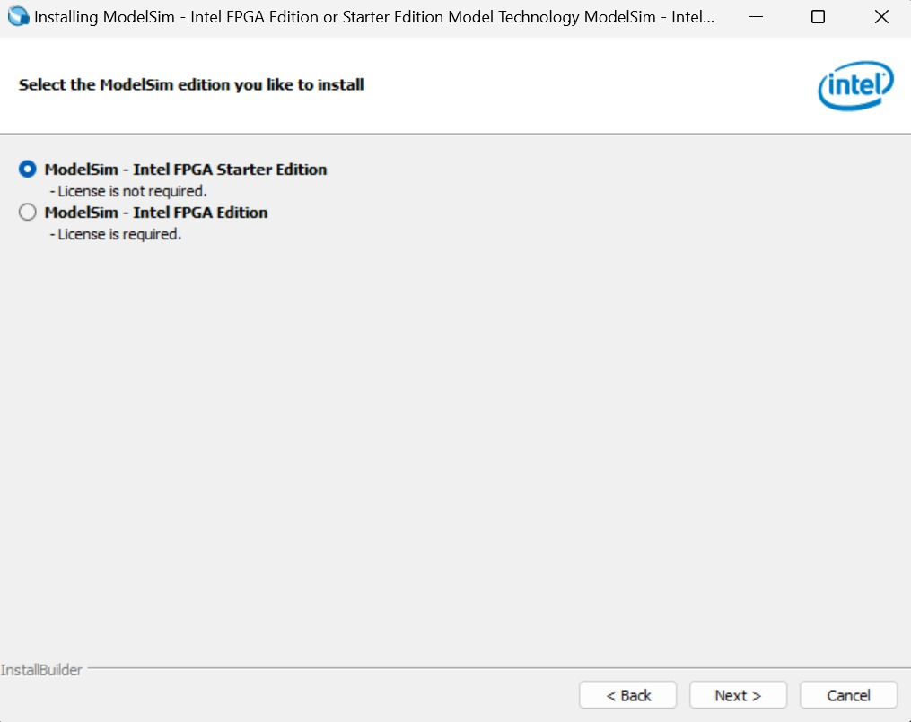

3. Escolha o diretório de instalação e clique em Next.

No diretório de instalação, coloque o ModelSim na mesma pasta do Quartus. Por exemplo, se o Quartus está em `C:/intelFPGA_lite/20.1/`, coloque o ModelSim em `C:/intelFPGA_lite/20.1/modelsim_ase/`.

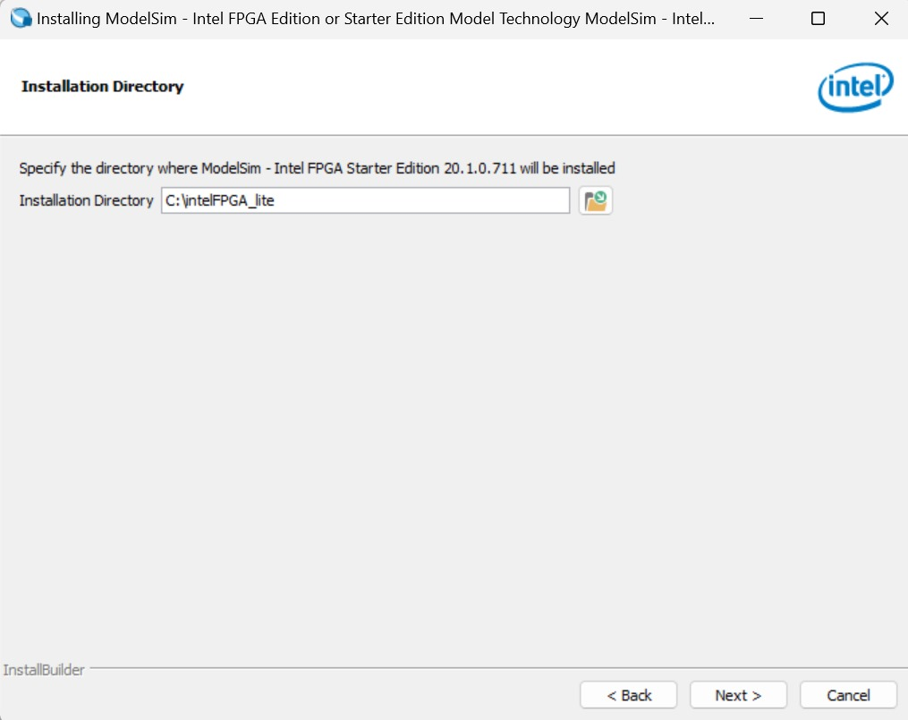

4. Clique em Install.

Após finalizar a intalação, abra o Quartus, no menu Superior selecione Tools -> Options. Na aba EDA Tool Options, altere o caminho do ModelSim-Altera para o caminho onde o ModelSim foi instalado. No caso de Linux, por exemplo, `/home/${USER}/IntelFPGA_lite/20.1/modelsim_ase/linuxaloem/`, enquanto no Windows é `C:/intelFPGA_lite/20.1/modelsim_ase/win32aloem/`. Após alterar o caminho, clique em OK e rode a simulação novamente.

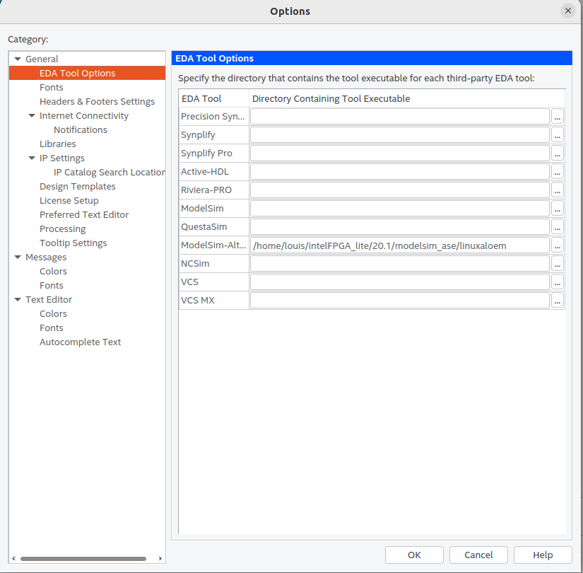